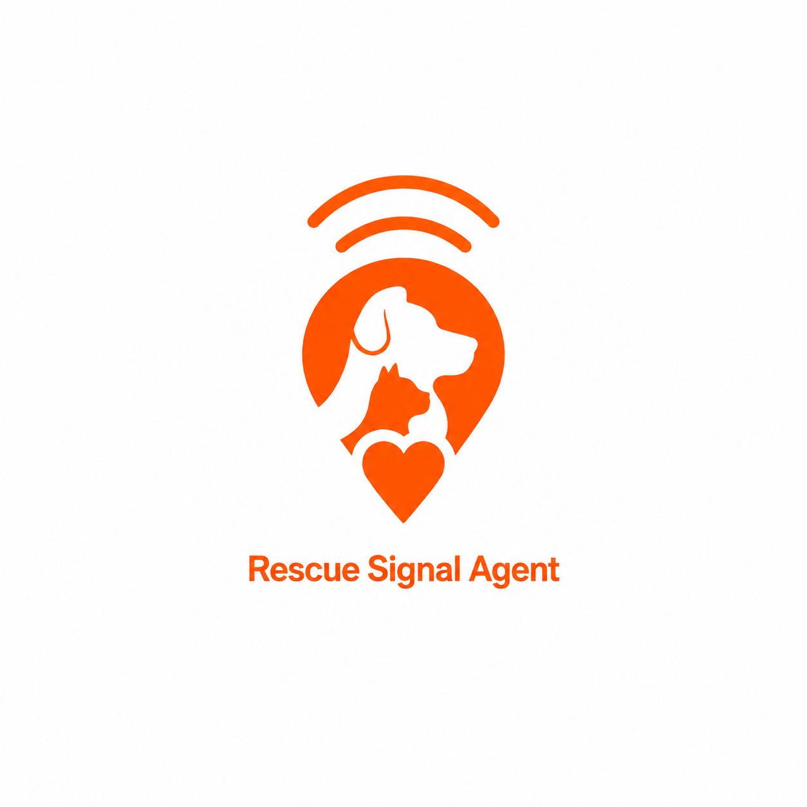

<p align="center">
  
</p>

<h1 align="center">Rescue Signal Agent</h1>

> **Rescue Signal Agent** — connecting scattered shelter data so the one-day difference between life and death is never missed.

[](https://nextjs.org/)
[](https://react.dev/)
[](https://www.typescriptlang.org/)
[](https://azure.microsoft.com/products/ai-services/openai-service)

🔗 **Live:** https://rescue-signal-agent-jh.azurewebsites.net

---

## 📌 Problem

Every year **more than 100,000 abandoned animals** enter shelters across Korea.
But the data that could save them — the **government public API** (Ministry of Agriculture, Food and Rural Affairs), SNS posts, and individual shelter notices — is **completely fragmented**.
As a result, the animals most urgently in need of adoption or fostering reach the end of their notice period **without anyone seeing them**.

## 💡 Solution

**Rescue Signal Agent** runs a **multi-agent orchestration** over public rescue-animal data and turns it into action.
Five role-specialized LLM agents (data / priority / match / message / notification) are coordinated by an orchestrator; each agent reasons and **calls tools** (the deterministic data-collection, scoring, and delivery functions), with a deterministic fallback if any agent fails. Built on Azure OpenAI (gpt-5-mini) function-calling — see `src/lib/agents/`.
Given a user's conditions (region, species, size, how they can help), it:

1. 🔍 **Collects** rescue-animal records from the public API (with a sample-data fallback)
2. 🧠 **Scores priority** — how urgently each animal needs attention (notice deadline, protection status, care-need signals, photo availability)
3. 🎯 **Scores match** — how well each animal fits *this* user, including care-fit penalties so no one is shown an animal they can't take on
4. ✍️ **Generates messages** — a shelter inquiry, an SNS share post, and a Discord notification, all under strict safety-wording rules
5. ✨ **Polishes** the messages with **Azure AI Foundry (Azure OpenAI, gpt-5-mini)** — with a graceful local fallback
6. 📣 **Delivers** in two ways:
   - **On-demand (web):** TOP 3 with transparent scoring, ready-to-send messages, a full-screen photo viewer, and one-click Discord alerts
   - **Automatic (scheduled):** every morning & evening, a Discord channel digest **and** a personalized email to each subscriber — matched to their own region/species

```
[Web UI] — user sets conditions (region / species / size / help type)
        ↓
[lib/rescue-data]          ── public data.go.kr API  →  fallback: sample data
        ↓
[lib/scoring]              ── priorityScore + matchScore (species hard-filter,
                              care-fit penalties)  ·  total = match×0.6 + priority×0.4  → TOP 3
        ↓
[lib/messages]             ── shelter inquiry · SNS post · Discord message (safe wording)
        ↓
[POST /api/messages/polish] ── Azure OpenAI (gpt-5-mini) refinement  →  fallback: local copy
        ↓
[Web]   TOP 3 + reasoning + photo viewer + Discord send / channel join + email subscribe

────────────────  Automatic delivery (no user action)  ────────────────

[Azure Logic Apps]     ── daily 09:00 / 18:00 KST (Korea Standard Time)
        ↓
[GET /api/cron]        ── (CRON_SECRET protected)
        ├─ Discord channels  → webhook digest per time×region channel
        └─ Email subscribers → personalized TOP 3 per subscriber (Azure Communication Services)
```

> ⚠️ **Safety first.** The app never claims an animal is scheduled for euthanasia. It uses neutral wording such as *"needs to be checked first"* and *"the notice period may be closing soon"*, and always tells users to confirm the latest status directly with the shelter.

---

## ✨ Key Features

- **Multi-agent orchestration** — 5 role-specialized LLM agents coordinated by an orchestrator, each reasoning + calling tools (data / scoring / delivery), with a live execution trace shown in the UI and a deterministic fallback.
- **Personalized matching** — species hard-filter, region/size scoring, and *care-fit penalties* (an animal needing medical/senior care is ranked down for users who can't take that on — unless they're only here to share/promote).
- **Transparent scoring** — every recommendation shows *why* it ranked where it did, including reasons that lowered its rank.
- **AI message polishing** — shelter inquiry, SNS post, and Discord copy, refined by Azure OpenAI with a local fallback.
- **Photo viewer** — full-screen lightbox with multi-photo navigation (arrows / thumbnails / dots / keyboard).
- **Scheduled automatic alerts** — two Azure Logic Apps trigger `/api/cron` daily at 09:00 / 18:00 KST; no server needs to stay awake.
- **Personalized email subscriptions** — pick a region + species + time, get a matched digest in your inbox (Azure Communication Services).
- **Discord delivery** — per-time/region channel digests via webhook, plus one-click send and a channel-join picker.
- **Graceful degradation** — every external dependency has a fallback; the app is always demoable.

---

## 🧩 Tech Stack

| Layer | Technology |
|-------|-----------|
| Framework | Next.js 16 (App Router, standalone output) |
| UI | React 19, Tailwind CSS v4, lucide-react |
| Language | TypeScript 5 |
| Data source | data.go.kr public rescue-animal API (`abandonmentPublicService_v2`) |
| AI | Azure AI Foundry / Azure OpenAI — `gpt-5-mini` (message polishing) |
| Email | Azure Communication Services (Email) |
| Storage | Azure Table Storage (email subscriptions) |
| Notifications | Discord Webhook |
| Scheduler | Azure Logic Apps (09:00 / 18:00 KST); GitHub Actions kept for manual test only |
| Hosting | Azure App Service (Linux, standalone bundle) |

---

## 🚀 Quick Start

```bash
# 1. Install dependencies
npm install

# 2. Configure environment variables
cp .env.local.example .env.local
# fill in the values you need (all optional — see table below)

# 3. Run the dev server (http://localhost:3002)
npm run dev

# 4. Build & start for production
npm run build
npm run start
```

> The app runs on **port 3002**. With no environment variables set, it still works on **sample data** and **locally generated messages** — perfect for a quick demo.

### Environment variables

| Variable | Purpose | Fallback if missing |
|----------|---------|---------------------|
| `PUBLIC_ANIMAL_API_KEY` | data.go.kr service key (URL-encoded) | sample data |
| `AZURE_OPENAI_ENDPOINT` / `AZURE_OPENAI_API_KEY` | Azure OpenAI for message polishing | local message generation |
| `AZURE_OPENAI_DEPLOYMENT` / `AZURE_OPENAI_API_VERSION` | deployment name / API version | `gpt-5-mini` / `2024-12-01-preview` |
| `DISCORD_WEBHOOK_URL` | default Discord channel webhook | Discord send disabled |
| `NEXT_PUBLIC_DISCORD_INVITE_URL` | public channel invite (build-time inlined) | join button hidden |
| `DISCORD_WEBHOOK_<REGION>_<SLOT>` | per-channel webhooks for condition-based channels | that channel is skipped |
| `CRON_SECRET` | protects `/api/cron` from public calls | `/api/cron` returns 401 |
| `APP_BASE_URL` | base URL for unsubscribe links | request origin |
| `SUBSCRIPTIONS_TABLE_CONN` | Azure Table Storage connection string | email subscribe disabled |
| `ACS_EMAIL_CONN` / `ACS_EMAIL_SENDER` | Azure Communication Services email | email sending disabled |

---

## ⏰ Scheduled & Personalized Alerts

Automatic delivery is driven by an **Azure-based scheduler** so the app can run on a free (sleeping) host:

1. **Two Azure Logic Apps** (`rescue-alert-morning` / `rescue-alert-evening`) fire daily at **09:00 / 18:00 KST** (timeZone: Korea Standard Time). Each has a fixed slot in the URL, so the label/target never drifts. *(GitHub Actions was dropped as the scheduler — it delayed runs and misclassified the slot; the workflow is kept for manual test only.)*
2. Each calls **`GET /api/cron?slot=morning|evening`** with the `x-cron-secret` header.
3. `/api/cron` then:
   - **Discord channels** — for each configured channel in `lib/alert-channels.ts` (time × region), posts a digest to its webhook (unconfigured channels are skipped).
   - **Email subscribers** — loads subscribers for the slot from Table Storage and emails each a TOP 3 matched to *their* region/species.

Users subscribe from the web UI (`/api/subscribe`) with their email + selected conditions + time, and can opt out anytime via the unsubscribe link (`/api/unsubscribe`).

---

## 📁 Project Structure

```
rescue-signal-agent/
├── .github/workflows/
│   └── scheduled-alert.yml                   # manual test only (scheduling → Azure Logic Apps)
├── src/
│   ├── app/
│   │   ├── page.tsx                          # UI + agent trace rendering
│   │   ├── layout.tsx
│   │   └── api/
│   │       ├── agent/orchestrate/route.ts    # multi-agent orchestration entrypoint
│   │       ├── rescue-animals/route.ts       # public data collection (thin wrapper)
│   │       ├── messages/polish/route.ts      # Azure OpenAI polishing + fallback
│   │       ├── notifications/discord/route.ts # Discord webhook send
│   │       ├── cron/route.ts                  # scheduled channel digests + subscriber emails
│   │       ├── subscribe/route.ts             # create email subscription
│   │       └── unsubscribe/route.ts           # remove email subscription
│   ├── lib/
│   │   ├── agents/
│   │   │   ├── runtime.ts                     # LLM agent + tool-calling loop
│   │   │   └── orchestrator.ts                # 5 agents + tools + orchestration
│   │   ├── rescue-data.ts                     # public API collection + sample fallback (shared)
│   │   ├── scoring.ts                         # priority + match scoring + TOP-N ranking
│   │   ├── messages.ts                        # safe-wording message generation
│   │   ├── alert-channels.ts                  # time × region Discord channel config
│   │   ├── subscriptions.ts                   # Azure Table Storage CRUD
│   │   └── email.ts                           # Azure Communication Services + digest builder
│   ├── data/
│   │   └── sample-rescue-animals.ts           # demo animals across regions
│   └── types/
│       └── rescue-animal.ts                   # shared domain types
├── AGENTS.md          # agent design & orchestration spec
├── IDEATION.md · PRD.md · TRD.md · PRESENTATION.md
```

---

## 🧠 How the Scoring Works

**Priority Score (0–100)** — *how urgently this animal needs attention*
- Notice deadline approaching (up to 40 pts)
- Currently under protection (15 pts)
- Care-need signals in special notes — injury, senior, illness, etc. (up to 25 pts)
- Has a photo, so it's easy to share on SNS (10 pts)

**Match Score (0–100)** — *how well this animal fits this user*
- Species match (up to 35 pts) — **and a hard filter**: if a species is chosen, other species are excluded entirely
- Region match (30 pts) · Size preference (15 pts, −5 on mismatch)
- **Care-fit**: senior/medical animal + *can care* → bonus; + *can't care* and intends to adopt/foster → **penalty** (the match adapts to `helpType` — for share-only users, care isn't penalized)
- Share fit (+10 pts when the animal has a photo and the user wants to share)

**Total** = `matchScore × 0.6 + priorityScore × 0.4` → top 3 are shown, each with a transparent breakdown of *why* it ranked where it did (including reasons that lowered its rank).

---

## 👥 Team

| Member | Responsibilities |
|--------|-----------------|
| **지현** (me) | Ideation · Planning · Agent design · UI · Data secondary filtering · Deployment |
| **경윤** | Instruction/guideline design · Data collection · Data primary filtering |

---

## 📋 Documents

- [IDEATION.md](IDEATION.md) — problem definition & ideation
- [PRD.md](PRD.md) — product requirements
- [TRD.md](TRD.md) — technical architecture & implementation spec
- [AGENTS.md](AGENTS.md) — agent design & orchestration
- [PRESENTATION.md](PRESENTATION.md) — presentation script & demo guide

---

*Built at the GitHub Copilot & Microsoft Agent Framework Hackathon 2026.*
*Public data source: Ministry of Agriculture, Food and Rural Affairs — Animal Protection Management System (data.go.kr).*

